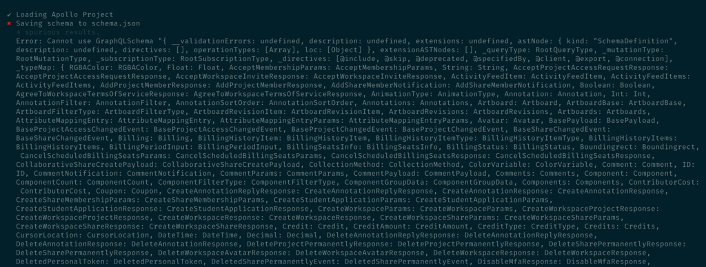

# Sketch document viewer

This is a simple viewer for Sketch documents stored in the cloud.

## Getting started

To get started:

1. First, run `yarn install` on your terminal to fetch all dependencies
2. In the applicatons's root directory, create a file for environment variables by running `cp .env.sample .env`
3. Open the .env file, and make sure the `REACT_APP_GRAPHQL_ENDPOINT` environment variable points to the Sketch GraphQL API endpoint
   (usually https://graphql.sketch.cloud/api)
4. Run `yarn start` to start the application

After following the instructions above, simply navigate to `http://localhost:3000/share/<document_id>`, where
**document_id** is the ID of the Sketch document you want to view (e.g. http://localhost:3000/share/e981971c-ff57-46dc-a932-a60dc1804992).

## About the application

### Stack & tooling

The application is written in React and TypeScript, as well as the following:

- [Emotion](https://emotion.sh/docs/css-prop) for styling (using the `css` prop)
- [react-router v6](https://reactrouter.com/) for routing
- [Apollo Client v3](https://www.apollographql.com/docs/react/) for the data layer
- To test some of the business logic; I used [react-hooks-testing-library](https://react-hooks-testing-library.com/)
  (think RTL but for... well, hooks) and Apollo's own [`MockedProvider`](https://www.apollographql.com/docs/react/development-testing/testing/) tooling.

### Assumptions

- Although the app should behave sensibly on smaller screens, mobile devices are not the primary target
- SEO is not a consideration
- The application doesn't need to be translated to multiple languages
- No need for a fully-fledged viewer (e.g. with an inspector for styles)
- Not user-facing, so don't worry about things like smaller bundles

### Key decisions

- The app consists of two routes: the **Document view** (`/share/:shareId`), and the **Artboard view** (`share/:shareId/artboard/:artboardId`)
  --and both live in the `src/pages` directory.
- Relatively shallow code structure, with separate directories for shared components, pages, hooks, and app configuration.
- Eschew magical values in the CSS, use custom properties wherever appropriate, and treat global styles as part of the app configuration
  (you can find these in `src/config/GlobalStyles`).
- Earlier on, I thought of keeping application state in a `DocumentViewer` context at the top-level. As I fleshed out the routes, though,
  I decided to simplify the data-flow and use Apollo client directly rather than spinning out an additional context of my own.

### The ~~not-so-beautiful~~ ugly parts

Overall, I'm fairly happy with what I came up with, but there's a few things I could have done better:

- Add image loaders, especially for the document view
- Add support for keyboard navigation (directional keys for previous/next artboard, and ESC to close the artboard)

### What I'd like to figure some day, maybe

- Umm... what is the `Artboard.isArtboard` flag used for? It was true in all entries, and seemed superfluous to me.
- Apollo has tooling to auto-generate types from a GraphQL schema. I got a few errors when I tried to use it with the Sketch API (see screenshot),
  but I want to try and get it to work one of these days --static typing is one thing, but having the API itself inform the type-checker is really cool!

Apollo codegen error ("spurious results")

